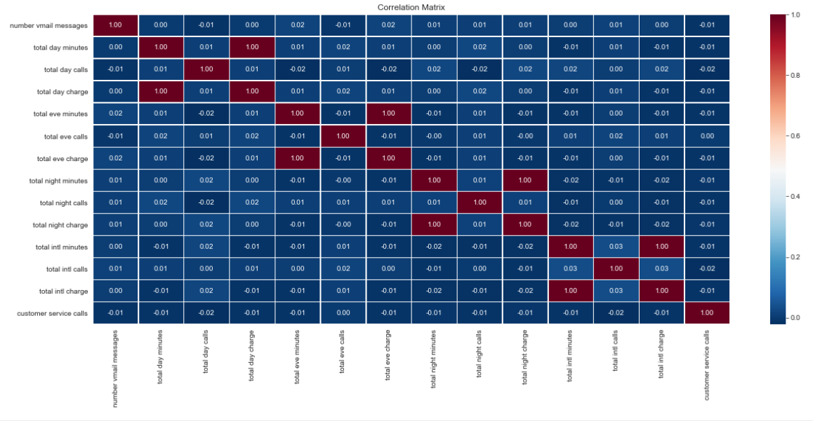
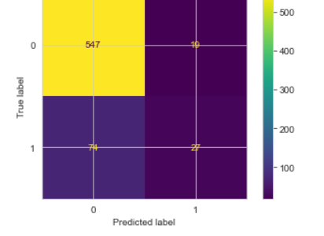
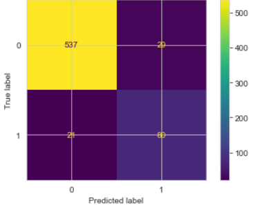
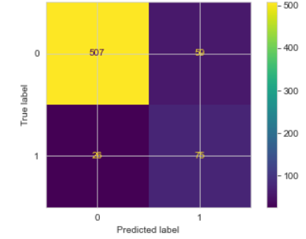
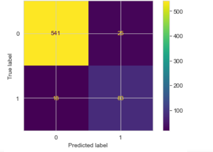
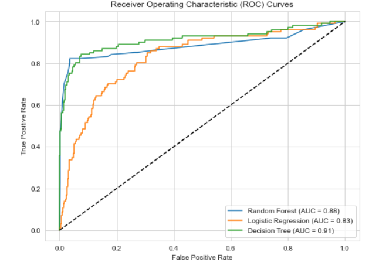

## Business Understanding

#### Business Problem
The telecom industry faces a high rate of customer churn, customer churn refers to the phenomenon where customers stop using the company’s services and switch to competitors. High churn rates negatively impact the company’s revenue, market share, and overall profitability. The primary business problem Syriatel faces is understanding the underlying factors driving customer churn and developing effective strategies to retain customers

#### Objectives
1. Develop machine learning models to predict customer churn using customer feature data.
2. Compare the performance of different models to determine the most accurate one for prediction.
3. Identify specific features significantly impacting customer churn rates.
4. Provide actionable recommendations based on analysis to help Seriatel reduce churn rates and improve customer retention.

### Data Understanding
The project uses historical customer data, including demographic and transactional information from Seriatel, to build a predictive model that classifies customers as churned or non-churned. The dataset comprises 3333 rows and 21 columns, with the company based in California, USA. The column titles are:

- **state**: Customer's state of residence.
- **area code**: Area code of the customer's phone number.
- **international plan**: Binary variable indicating if the customer has an international calling plan (1) or not (0).
- **voice mail plan**: Binary variable indicating if the customer has a voicemail plan (1) or not (0).
- **number vmail messages**: Number of voicemail messages the customer has.
- **total day minutes**: Total daytime usage minutes.
- **total day calls**: Total daytime calls made or received.
- **total day charge**: Total daytime usage charges.
- **total eve minutes**: Total evening usage minutes.
- **total eve calls**: Total evening calls made or received.
- **total eve charge**: Total evening usage charges.
- **total night minutes**: Total night usage minutes.
- **total night calls**: Total night calls made or received.
- **total night charge**: Total night usage charges.
- **total intl minutes**: Total international call minutes.
- **total intl calls**: Total international calls made.
- **total intl charge**: Total international call charges.
- **customer service calls**: Number of customer service calls made by the customer.
- **churn**: Binary variable indicating if the customer has churned (1) or not (0).
- **total_calls**: Total calls made or received across all periods (day, evening, night).
- **total_charge**: Total charges incurred across all usage periods.

### Data Processing for Customer Churn Analysis

#### Introduction
In conducting a customer churn analysis, it is crucial to outline the steps and methodologies used to process the data. This statement provides a comprehensive overview of the data processing techniques employed to ensure accurate and meaningful insights into customer churn patterns.

#### Data Preprocessing
Preprocessing is essential to clean and prepare the data for analysis. The following steps were undertaken:
- **Data Cleaning**: Removal of duplicates, handling of missing values, and correction of inconsistencies, identifying outliers.

- **Data Integration**: Merging data from different sources to create a unified dataset.
- **Data Transformation**: Standardizing data formats, converting categorical variables into numerical formats (e.g., one-hot encoding), and normalizing numerical variables.
- **Feature Engineering**: Creating new features that can provide additional insights into churn patterns, such as customer tenure, average response time, and frequency of service use.

#### Data Analysis Techniques
Various analytical techniques were employed to identify and understand customer churn:
- **Descriptive Statistics**: Summarizing the central tendencies, dispersions, and distributions of the data.
- **Correlation Analysis**: Identifying relationships between different variables and their influence on churn.

- **Predictive Modeling**: Using machine learning models such as logistic regression, decision trees, and random forests to predict the likelihood of churn.
- **Clustering**: Grouping customers with similar behaviors and attributes to identify distinct segments with varying churn risks.
- **Survival Analysis**: Estimating the time until churn for different customer segments.

#### Model Validation and Evaluation
To ensure the reliability and accuracy of the predictive models, the following steps were taken:
- **Cross-Validation**: Splitting the data into training and test sets to validate the model's performance.
- **Performance Metrics**: Using metrics such as accuracy, precision, recall, F1-score, and ROC-AUC to evaluate model performance.
- **Baseline Logistic Regression**
The logistic regression model shows significantly better performance for class 0 across all metrics (precision, recall, F1-score) compared to class 1. The overall accuracy of the model is 86.1%, indicating a relatively high rate of correct predictions on the test data.

- From the above, it can be observed that the logistic regression model has a ROC AUC value of 0.8938 on the training data and 0.6169 on the test data. This indicates that the model has a relatively high level of discrimination between classes on the training data compared to the test data.

- The confusion matrix shows the predicted and true labels of the logistic regression model, with 27 true positives, 74 false negatives, 547 true negatives, and 10 false positives.

- In summary, the model achieves a training accuracy of approximately 89.4% and a testing accuracy of around 86.0%, indicating that the model performs reasonably well in predicting class labels for both datasets.

- However, the confusion matrix reveals that the model is not highly accurate in its predictions, and there is evidence of overfitting.

- **Decison Trees classifier model**

- roc_auc_train: This metric measures the model's ability to distinguish between the two classes (positive and negative) in the training data. A value of 0.886 indicates that the model effectively classifies the training instances.

- roc_auc_test: This metric evaluates the model's ability to generalize its predictions to new, unseen data. A value of 0.870 suggests that the model maintains good performance on the test data, indicating it is not overfitting.

- accuracy_train: This represents the proportion of correctly classified instances in the training set. A value of 0.886 shows that the model achieves a high accuracy level on the training data.

- accuracy_test: A value of 0.925 indicates that the model performs very well on the testing data, demonstrating good generalization and no overfitting.

From the confusion matrix, we see 80 true positives, 537 true negatives, 29 false positives, and 21 false negatives, indicating improved prediction performance.

**Random Forest Model**

- The Random Forest classifier achieves an accuracy of approximately 87.1% on the training data and 87.2% on the testing data. 
- It performs well in distinguishing between positive and negative classes, with an area under the ROC curve (AUC) of 0.87 for the training data and 0.82 for the testing data. Overall, the model demonstrates a high level of accuracy in predicting the target variable.
-According to the confusion matrix, there are 75 true positives, 507 true negatives, 50 false positives, and 26 false negatives. This accuracy is slightly lower compared to the Decision Tree classifier.

- **Hyperparameter Tuning**: Optimizing model parameters to improve predictive accuracy and robustness.
- **Random Forest**

- The tuned Decision Tree model achieved a training accuracy of 90.4% and an improved test accuracy of 93.6%. This suggests that the model is performing well and has learned patterns in the data that enable accurate predictions.
The Logistic Regression model attained an AUC-ROC score of around 0.904 on the training data and 0.888 on the test data
- **Evaluation model-ROC Curve**

-Based on the AUC curve, we can infer the following:

-The Decision Tree achieves an AUC of 0.91, indicating strong discriminatory power and effective distinction between positive and negative classes. It maintains a high true positive rate (TPR) with a low false positive rate (FPR), resulting in a larger ROC curve area.

-The Random Forest achieves an AUC of 0.88, slightly lower than the Decision Tree. It also demonstrates good classification ability but may have slightly higher false positive and false negative rates compared to the Decision Tree.

-The Logistic Regression model achieves the lowest AUC of 0.83 among the three models, suggesting weaker discriminatory performance and potentially higher false positive and false negative rates.

-The Decision Tree has the largest area under the ROC curve, followed by the Random Forest, indicating superior discriminatory power and better performance in distinguishing between positive and negative classes.

-Therefore, the Decision Tree Classifier is the best model for serial because it has the largest area under the curve and the highest accuracy in predicting customer churn.

**Conclusion**
By utilizing the best model, which is the Random Forest, Seriatel can achieve significant benefits:

- Accurate Prediction of Customer Churn: The model's high accuracy ensures effective identification of customers likely to churn. This allows Seriatel to proactively implement retention strategies, potentially reducing customer attrition and associated costs.

- Cost Efficiency: Accurately predicting churn enables targeted resource allocation for retention efforts, such as personalized offers and improved customer service, focusing efforts where they are most needed and optimizing costs.

- Enhanced Customer Retention: Predicting churn accurately allows Seriatel to intervene before customers leave, addressing their concerns and providing incentives to stay. This helps maintain a loyal customer base and boosts satisfaction and loyalty.

- Informed Business Decisions: Accurate churn prediction provides valuable insights into customer behavior, guiding strategic decisions like product improvements, customer experience enhancements, and targeted marketing campaigns aimed at reducing churn and improving retention.
